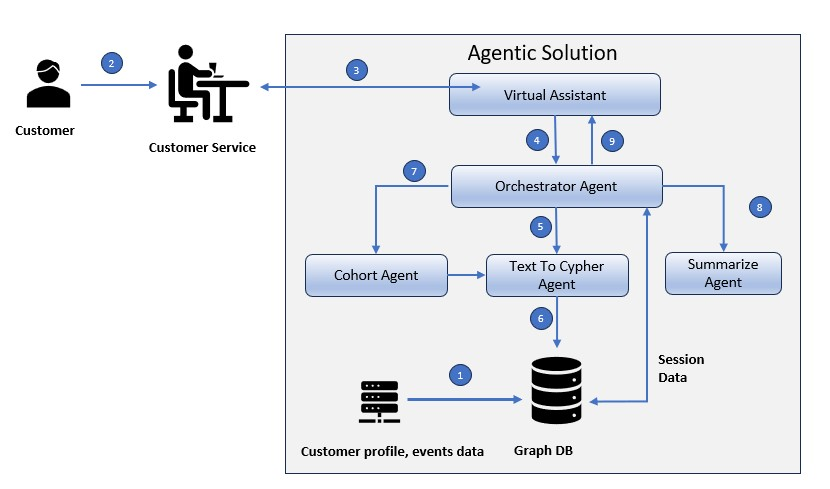

# Customer Service Agentic Application (Neo4j + LLM + Google ADK)

This project demonstrates an end-to-end **agentic** architecture for a
customer service assistant that works against existing Neo4j graph.
## Conceptual Architecture


Components:

- **Streamlit UI** (`cust_service_app.py`) – chat-style UX for customer service reps.
- **OrchestratorAgent** (`orchestrator_agent.py`) – Business Accelerator agent
  coordinating sub-agents.
- **TextToCypherAgent** (`text_to_cypher_agent.py`) – converts natural-language
  questions to Cypher using an LLM (LangChain + Neo4jGraph) and executes them.
- **CohortAgent** (`cohort_agent.py`) – Agent that finds possible Cohorts associated with current customer
  such as any open Events
- **SummarizationAgent** (`summary_agent.py`) – ADK agent that uses google LLM to summarize the results from sub agents such as TextToCypherAgent and CohortAgent
- **Neo4jMemoryStore** (`neo4j_memory.py`) – shared conversation memory stored
  directly in Neo4j as (:Session)-[:HAS_TURN]->(:Turn) as well as Customer Profile, Products and Events.
- **Neo4jClient** (`neo4j_client.py`) – small helper around the official Python driver.
- **config.py** – configuration via environment variables and `.env`.

The **Cypher system prompt** in `text_to_cypher_agent.py` is tuned to actual Neo4j schema used in this project:

- `(:Customer {customerId, name, address, sex, gender, ethnicity})`
- `(:Product {ProductID, Product, ...})`
- `(:Event {EventID, event_type, event_status, ...})`
- Relationships like:
  - `(:Customer)-[:HAS_PRODUCT]->(:Product or :Products)`
  - `(:Customer)-[:HAS_EVENT|HAS_EVENTS]->(:Event or :Events)`

## Getting started

1. Create and activate a virtual environment.
2. Install dependencies:

   ```bash
   pip install -r requirements.txt
   ```

3. Create a `.env` file at the project root with at least:

   ```env
   OPENAI_API_KEY=your-openai-key
   NEO4J_URI=neo4j+s://your-host:7687
   NEO4J_USER=neo4j
   NEO4J_PASSWORD=your-password
   OPENAI_API_KEY=your open AI key
   GOOGLE_API_KEY=your google api key

4. Ensure your Neo4j database is populated using the CSVs  provided
   (`neo_customers.csv`, `neo_products.csv`, `neo_events.csv`,
   `neo_cust_product_relationships.csv`, `neo_customer_event_relationships.csv`)
   with labels and relationships as described.

5. Run the Streamlit app:

   ```bash
   streamlit run ui/cust_service_app.py
   ```

6. Ask questions such as:

   - `What are the products customer with id CUST0007 has with us?`
   - `Are there any open events from this customer with name John Doe?`

The orchestrator will:

- Call the **TextToCypher agent** to ask Neo4j.
- Call the **Find Cohorts**  agent which will query the Neo4j using the TextToCypher agent.
- Call the **Summarization** ADK agent to summarize the results.
- Store the conversation history in Neo4j as shared memory.
